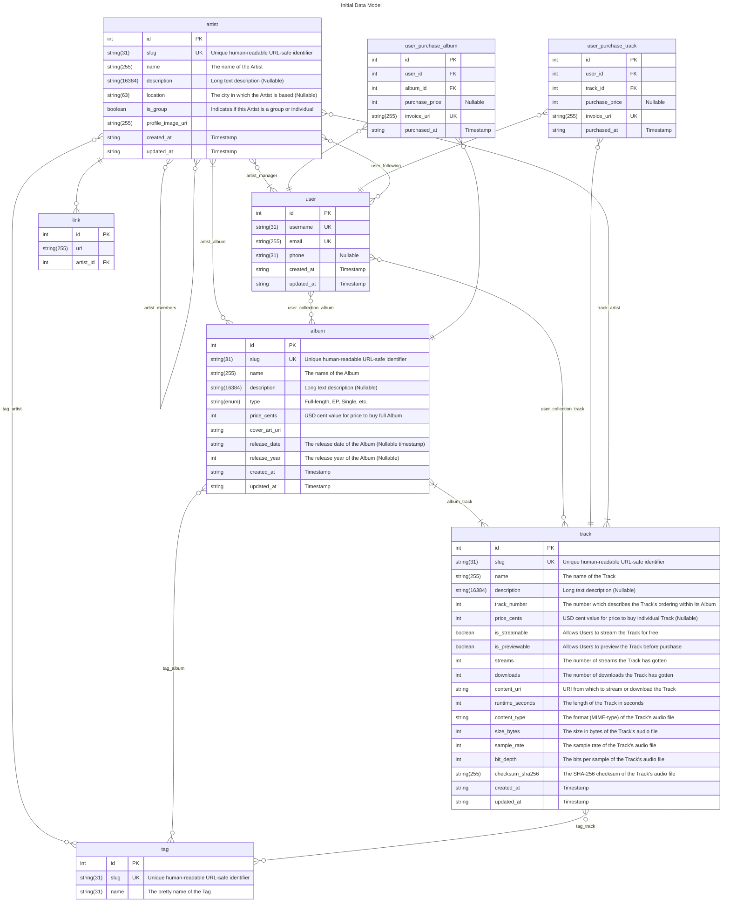

# Initial Data Model Design
This doc details the initial design for the data model. This represents how data will be
stored persistently for consumption by the API and other backend services. 

## Problem Description
Straightforwardly, we need a way to represent the data we plan to store such that it is
easy to read, update, and interpret. The perceived data requirements for this project
appear to be very simple, so we only need to translate them into a simple database model.

The way that data is represented here does not necessarily reflect how it will look in 
the API, although they should be similar so that programming with either is consistent. 

## Philosophy
The data we'll be storing should be easily represented with a relational database model. 
The model should reflect data owned by "Entities" (**Artist**, **Album**, Song, etc.), and how 
the entities relates to each other. 

For example, data owned by an **Artist** would include attributes such as the artist's name, 
and an **Artist** would also "own" multiple **Album**s. This could be represented as a one-to-many
relationship or a many-to-many relationship if we want to link multiple **Artist**s to a single
**Album**. Decisions like this ultimately cascade into larger design decisions about the project,
so it's important to get them right here with future considerations as to not be constantly 
changing the project's data model over time. Preferable changes to the data model are additions,
and we should look to avoid drastically modifying existing data as the project grows.

### Schema
Because the data is fundamentally based on entities (tables) and relationships, the data will
be designed with relational (SQL) databases in mind. 

## Requirements
As of now, requirements are fairly simple. For a minimum viable product, we are scoped to include
only a few pages. To serve these pages, we'll need to represent the following:

- **Artist**
- **Album**
- **Track**
- **User**
- **Purchase**

The data model doesn't necessarily describe all the capabilities of the backend, just the
data that we intend to store persistently. Some data may be generated by the server as needed,
and as such is not included in the data model.

## Models
Below is a standard _Entity-Relationship (ER)_ diagram which describes the data owned
by each entity and how the entities relate to each other.



## Notes

- While most of the many-to-many relationship tables are minimally simple (two columns, each containing IDs),
  there are a couple (`user_purchase_album`, `user_purchase_track`) that are
  defined explicitly within the diagram because they are a touch more complex.

### Artists
- If an **Artist** is a group, it can be linked to individual **Artist**s as members so that **User**s
can browse the **Artist**'s solo work or work with other groups. **User**s will also be able to browse 
the groups of which an **Artist** is a member from the individual **Artist**'s page.
- An **Artist** may be without a manager if a **User** uploads an **Album** and credits an artist who
doesn't have an account. A dummy **Artist** entity would be created and would somehow have to be claimed
by the real artist in the event they do decide to make an account.

### Album
- Allows **Artist**s to specify a `release_year` if the exact `release_date` is unknown

### Tracks
- The price for a **Track** is nullable in case the **Artist** doesn't want to allow individual **Track**s
to be purchased. If the **Artist** wants the **Track** to be free, the price can be set to zero.
- `is_streamable` allows users to stream a **Track** for free even if it is available for purchase
- **Track**s have their own relationship to **Artist**s in the case of a guest **Artist** or other contributor
who is not credited on the full album. If a **Track** does not relate to any **Artist**s, use the **Artist**s 
related to the **Track**'s **Album**.

### Links
- **Artist**s can display links on their page to social media, merch, etc.

### User
- The entity described by the diagram is the most basic data required to represent a **User**. 
The specification is likely to change drastically during the design for authentication and 
authorization.

### Purchase
- There are separate tables for **Album** and **Track** purchases so that the database can reliably
track the relationships between the relevant entities.
- The **Purchase** tables may change once we figure out our e-commerce platform.

## Future considerations
### Artists
- `verified` attribute to guard against impersonation
  - May also be used to claim **Artist**s without a linked **User**
- **Playlist** model
  - Could look something like
    ```mermaid
    erDiagram
    playlist {
        int id PK
        string(31) slug UK "Unique human-readable URL-safe identifier"
        string(255) name "The name of the Playlist"
        string(16384) description "Long text description (Nullable)"
        string(255) cover_art_uri "Nullable"
        int owner_id FK "User who owns this Playlist"
        string created_at "Timestamp"
        string updated_at "Timestamp"
    }
    playlist_track {
        int id PK
        int playlist_id FK
        int track_id FK
        int manual_order "The manual sorting order for the Track in the Playlist"
        string added_at "Timestamp"
        string updated_at "Timestamp"
    }  
    playlist ||--o{ playlist_track : ""
    playlist_track }o--|| track : ""
    ```